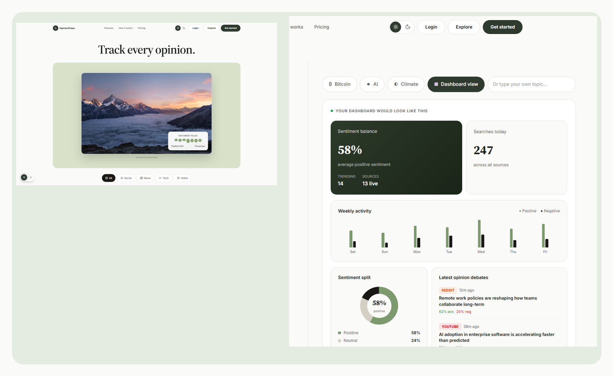

<p align="center">
  
</p>

<h1 align="center">OpinionPulse</h1>

<p align="center">
  <strong>Track every opinion.</strong><br />
  AI-powered sentiment tracking across Reddit, YouTube, news, social, and forums — with debate detection, crisis radar, and live market intelligence.
</p>

<p align="center">
  <a href="https://github.com/Shefilkhan/AI-Opinion-Tracking-/actions"></a>
  <a href="https://github.com/Shefilkhan/AI-Opinion-Tracking-/tree/Dev"></a>
  
  
  
  <a href="https://github.com/Shefilkhan/AI-Opinion-Tracking-#demo"></a>
</p>

<p align="center">
  
</p>

<p align="center">
  <a href="#features">Features</a> ·
  <a href="#tech-stack">Tech stack</a> ·
  <a href="#setup">Setup</a> ·
  <a href="#demo">Demo</a> ·
  <a href="docs/demo-script.md">Demo script</a>
</p>

---

## Overview

**OpinionPulse** is a full-stack SaaS for monitoring public sentiment at scale. Search any brand, topic, or keyword once and pull live results from **13 integrated platforms**, then layer on AI summaries, debate cards, trend forecasts, keyword alerts, and **Crisis Radar** early-warning monitoring.

Built as a final-year project on the **`Dev`** branch — designed for real demos with optional API keys (Groq, YouTube, Reddit, Quiver Quant, and more).

## Features

| Module | Description |
|--------|-------------|
| **Search** | Parallel search across Reddit, YouTube, HN, Dev.to, NewsAPI, Guardian, Bluesky, Mastodon, GitHub, Stack Overflow, Wikipedia, GNews, Currents |
| **AI insights** | Groq-powered summaries, debate analysis, and trend predictions |
| **Crisis Radar** | Volume + velocity matrix, narrative clusters, spread timeline, email alerts |
| **Market intel** | Live stock/crypto charts + Quiver Quant alt-data (congress trades, insiders, 13F, lobbying) |
| **Alerts** | Keyword watches with personal alert rules |
| **Auth** | JWT signup/login, Google OAuth, OTP verification |
| **Reports & export** | Generated summaries, CSV export, print-friendly views |
| **Plans & billing UX** | Starter / Pro / Enterprise pricing, checkout flow, platform marquee |

## Tech stack

- **Frontend:** React, Vite, TypeScript, Tailwind CSS v4, shadcn/ui, TanStack Query, Recharts
- **Backend:** FastAPI, SQLAlchemy, PyMySQL, Pydantic, JWT, APScheduler
- **Database:** MySQL / MariaDB (XAMPP)
- **AI:** Groq (default) with optional Anthropic
- **Alt data:** Quiver Quantitative (optional `QUIVER_API_KEY`)

## Folder structure

```
AI-Opinion-Tracking-/
  docs/
    assets/                  # README logo + hero image
    demo-script.md
    final-testing-checklist.md
  opinionpulse/
    opinionpulse-frontend/   # React app
    opinionpulse-backend/    # FastAPI API
```

## Setup

### 1. Database (XAMPP)

1. Start **MySQL** in XAMPP Control Panel.
2. Open http://localhost/phpmyadmin
3. Create database **`opinionpulse_db`** (utf8mb4), or let the backend create it in development.

### 2. Backend

```bash
cd opinionpulse/opinionpulse-backend
python -m venv venv
venv\Scripts\activate
pip install -r requirements.txt
copy .env.example .env.local
# Edit .env.local — DB credentials, SECRET_KEY, optional API keys
uvicorn app.main:app --reload
```

- API: http://localhost:8000  
- Docs: http://localhost:8000/docs  
- Health: http://localhost:8000/api/health  

### 3. Frontend

```bash
cd opinionpulse/opinionpulse-frontend
npm install
npm run dev
```

- App: http://localhost:5173  
- Set `VITE_API_BASE_URL=http://localhost:8000` in `.env` if needed.

## Environment variables (backend)

See `opinionpulse/opinionpulse-backend/.env.example`:

| Variable | Purpose |
|----------|---------|
| `DB_*` | MySQL connection |
| `SECRET_KEY` | JWT signing |
| `GROQ_API_KEY` | AI summaries & crisis narratives |
| `YOUTUBE_API_KEY` | YouTube search |
| `REDDIT_*` | Reddit API (PRAW) |
| `QUIVER_API_KEY` | Congressional trades, insiders, 13F, lobbying (optional) |
| `EMAIL_*` | SMTP for OTP, newsletter, crisis alerts |

Never commit `.env.local` or expose secrets to the frontend.

## Demo

1. Sign up / log in  
2. Run a **Search** on a topic (e.g. Bitcoin, OpenAI, Tesla)  
3. Review sentiment, debates, and platform breakdown  
4. Enable **Alerts** for a keyword watch  
5. Open **Crisis Radar** — scan watches, view narratives & market charts  
6. Try **Explore** (public demo) and **Pricing** checkout flow  

Full script: [docs/demo-script.md](docs/demo-script.md)  
Testing: [docs/final-testing-checklist.md](docs/final-testing-checklist.md)

## Brand assets

| Asset | Path |
|-------|------|
| App icon (SVG) | [docs/assets/opinionpulse-icon.svg](docs/assets/opinionpulse-icon.svg) |
| Wordmark (SVG) | [docs/assets/opinionpulse-logo.svg](docs/assets/opinionpulse-logo.svg) |
| README hero | [docs/assets/readme-hero.png](docs/assets/readme-hero.png) |

## More detail

- [opinionpulse/README.md](opinionpulse/README.md)  
- [opinionpulse/opinionpulse-backend/README.md](opinionpulse/opinionpulse-backend/README.md)  
- [opinionpulse/opinionpulse-frontend/README.md](opinionpulse/opinionpulse-frontend/README.md)

---

<p align="center">
  <sub>Final-year project · <a href="https://github.com/Shefilkhan/AI-Opinion-Tracking-">Shefilkhan/AI-Opinion-Tracking-</a></sub>
</p>
